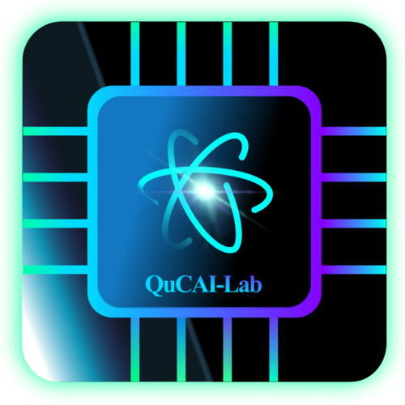

  

  <h1 align="center"> QuCAI-Lab </h1>
  <h2 align="center">Quantum-Classical Artificial Intelligence Laboratory </h2>

 

<!-- ############################################################################################################################################################## -->

# Table of Contents
- **[Research areas of interest](#Research)**
- **[Community resources](#Community)**
  - **[Quantum Mechanics](#Mechanics)**
  - **[Quantum Information and Quantum Computing](#Information)**
  - **[cQED](#cQED)**
  - **[SQC](#SQC)**
  - **[CML](#CML)**
  - **[QML](#QML)**
  - **[Frameworks](#Frameworks)**
  - **[QC Tutorials](#QCt)** 
  - **[QML Tutorials](#QMLt)** 
  
<!-- ############################################################################################################################################################## -->

# &nbsp;  Research areas of interest<a name="Research" />  

- Development of quantum-classical deep learning algorithms for optimization of VQE experiments and Quantum Kernels.
- Development of classical reinforcement learning algorithms (online/offline) for optimization of circuit-based superconducting qubits in circuit QED.

<!-- ############################################################################################################################################################## -->

# &nbsp;  Community resources<a name="Community" />

## **Quantum Mechanics**<a name="Mechanics" /> 
  - Books: 
    - [Introduction to Quantum Mechanics: Griffiths, David J.](https://www.fisica.net/mecanica-quantica/Griffiths%20-%20Introduction%20to%20quantum%20mechanics.pdf)
    - [The Feynman Lectures on Physics, Volume III: quantum mechanics](https://www.feynmanlectures.caltech.edu/III_toc.html).

## **Quantum Information and Quantum Computing** <a name="Information" /> 
  - Books:
    - Nielsen MA, Chuang IL. 2010. Quantum Computation and Quantum Information. New York: [Cambridge Univ. Press.](https://doi.org/10.1017/CBO9780511976667) 10th Anniv. Ed.
  - Courses:
    - [USC Quantum Computation and Open Quantum Systems](http://qserver.usc.edu/meetings/quantum-courses/).
    - [John Preskill. "Course Information for Physics 219/Computer Science 219 Quantum Computation." California Institute of Technology](http://theory.caltech.edu/~preskill/ph229/).
  - Playlist:
    - Qiskit videos:
      - [Circuit Sessions with Jay Gambetta](https://www.youtube.com/watch?v=Omv-bPvQ3E8&ab_channel=Qiskit).
    - Institute for Quantum Computing:
      - [Quantum Computing & the Entanglement - John Preskill](https://www.youtube.com/watch?v=3XbQpUtqgnU&list=PLneI7EukdQSUSgGVFHS0LKCGyhLVQtXhT&index=76&ab_channel=InstituteforQuantumComputing). 
    
## **Circuit Quantum Electrodynamics (cQED)**<a name="cQED" /> 
  - Playlist:
    - [Circuit QED - QuTech Academy](https://www.youtube.com/watch?v=JmnpcWEuMJY&list=PLneI7EukdQSUSgGVFHS0LKCGyhLVQtXhT&index=25&ab_channel=QuTechAcademy).  
  - Books:
    - "Introduction to Superconducting Circuits," Alan M. Kadin, John Wiley & Sons (1999). 
  - Lectures:
    - Uri Vool, M. H. Devoret, "Introduction to Quantum Electromagnetic Circuits," [arXiv:1610.03438v2](https://arxiv.org/abs/1610.03438), 2017.
  - Thesis:
    - [D. I. Schuster, "Circuit quantum electrodynamics", PhD thesis, Yale University, 2007. UMI No. 3267357](https://rsl.yale.edu/sites/default/files/files/RSL_Theses/SchusterThesis.pdf).
    - [Lev Bishop, "Circuit Quantum Electrodynamics", PhD Thesis (2010)](https://www.levbishop.org/thesis/). 
  - Papers:
    - Josephson, B.D. (1962). "Possible new effects in superconductive tunnelling". [Physics Letters](https://www.sciencedirect.com/science/article/abs/pii/0031916362913690). 1 (7): 251–253.
    - A. Blais et al., "Circuit quantum electrodynamics," [Rev. Mod. Phys.](https://journals.aps.org/rmp/abstract/10.1103/RevModPhys.93.025005) (2020). 

## **Superconducting Quantum Computing (SQC)**<a name="SQC" /> 
  - Playlist:  
    - Qiskit videos:
      - [A Brief History of Superconducting Quantum Computing](https://www.youtube.com/watch?v=xjlGL4Mvq7A&list=PLneI7EukdQSUSgGVFHS0LKCGyhLVQtXhT&index=83&ab_channel=Qiskit).   
    - Institute for Quantum Computing: 
      - [Alexandre Blais - Quantum Computing with Superconducting Qubits](https://www.youtube.com/watch?v=t5nxusm_Umk&ab_channel=InstituteforQuantumComputing).
    - APS March Meeting:
      - [Joe Bardin et al., "Control of transmon qubits using a cryogenic CMOS integrated circuit"](https://www.youtube.com/watch?v=VA2HEUmkrKo&ab_channel=TensorFlow).
      - [Jens Koch - scqubits](https://www.youtube.com/watch?v=ZccDfs-_40Y&list=PLneI7EukdQSUSgGVFHS0LKCGyhLVQtXhT&index=47&ab_channel=JensKoch).
  - Courses:
    - [ETH Zürich - Quantum Information Processing (QIP) II: Implementations](https://qudev.phys.ethz.ch/node/5876).
    - [TU Delft MOOC: The Hardware of a Quantum Computer](https://online-learning.tudelft.nl/courses/the-hardware-of-a-quantum-computer/).
    - [2020 Qiskit Global Summer School: Introduction to Quantum Computing and Quantum Hardware](https://qiskit.org/learn/intro-qc-qh/).
  - Papers:
    - A. Blais et al., "Cavity quantum electrodynamics for superconducting electrical circuits: An architecture for quantum computing," [Phys. Rev. A.](https://journals.aps.org/pra/abstract/10.1103/PhysRevA.69.062320) APS. 69: 062320 (2004).
    - J. Koch, "Charge-insensitive qubit design derived from the Cooper pair box," [Phys. Rev. A](https://journals.aps.org/pra/abstract/10.1103/PhysRevA.76.042319) 76, 042319 (2007).
    - Gambetta, J.M., Chow, J.M. & Steffen, M. Building logical qubits in a superconducting quantum computing system. [npj Quantum Inf 3, 2 (2017)](https://www.nature.com/articles/s41534-016-0004-0)

  - Surveys:
    - [2004: "Superconducting Qubits: A Short Review."](https://arxiv.org/pdf/cond-mat/0411174.pdf)
    - [2013: "Hybrid quantum circuits: Superconducting circuits interacting with other quantum systems."](https://journals.aps.org/rmp/abstract/10.1103/RevModPhys.85.623)
    - [2017: "Quantum information processing with superconducting circuits: a review."](https://iopscience.iop.org/article/10.1088/1361-6633/aa7e1a)
    - [2019: "A quantum engineer's guide to superconducting qubits."](https://aip.scitation.org/doi/10.1063/1.5089550)
    - [March 2020: "Superconducting qubits: Current state of play."](https://doi.org/10.1146/annurev-conmatphys-031119-050605)
    - [July 2020: Superconducting Parametric Amplifiers: The State of the Art in Josephson Parametric Amplifiers.](https://ieeexplore.ieee.org/document/9134828)
    - [2021: "Gate-based superconducting quantum computing."](https://aip.scitation.org/doi/10.1063/5.0029735)

## **Classical Machine Learning (CML)**<a name="CML" /> 
  - Playlist:
    - [MIT 6.S191 (2020): Introduction to Deep Learning](https://www.youtube.com/watch?v=njKP3FqW3Sk&list=PLneI7EukdQSXE_cnz6z8Qn0aONTGKusq-&index=33&ab_channel=AlexanderAmini).
    - [3Blue1Brown: Backpropagation calculus - Chapter 4, Deep learning](https://www.youtube.com/watch?v=tIeHLnjs5U8&list=PLneI7EukdQSXE_cnz6z8Qn0aONTGKusq-&index=23&ab_channel=3Blue1Brown).
    - [MIT 6.S191: Reinforcement Learning](https://www.youtube.com/watch?v=93M1l_nrhpQ&list=PLneI7EukdQSXE_cnz6z8Qn0aONTGKusq-&index=26&ab_channel=AlexanderAmini).
    - [Deep Reinforcement Learning: Policy Gradients and Q-Learning (John Schulman, OpenAI)](https://www.youtube.com/watch?v=PtAIh9KSnjo).
    - [Deep Reinforcement Learning via Policy Optimization (John Schulman, OpenAI)](https://www.youtube.com/watch?v=y4ci8whvS1E).
    - [John Schulman 1: Deep Reinforcement Learning](https://www.youtube.com/watch?v=aUrX-rP_ss4).
  - Books:
    - Deep Learning (Ian J. Goodfellow, Yoshua Bengio and Aaron Courville), [MIT Press](https://www.deeplearningbook.org/), 2016].  
    - "Reinforcement Learning: An Introduction." Richard S. Sutton and Andrew G. Barto. [Cambridge, MA: The MIT Press, March 22, 2018, 548 pp.](#).
  - Couses:
    - Supervised Learning
      - [fast.ai MOOC](https://www.fast.ai/).  
      - [Google's fast-paced, practical introduction to machine learning](https://developers.google.com/machine-learning/crash-course).
    - Reinforcement Learning
    	- [UCL COMPM050/COMPGI13 (2015): RL by David Silver](https://www.davidsilver.uk/teaching/).
    	- [UC Berkeley CS285 (Fall 2022): Deep RL by Sergey Levine](http://rail.eecs.berkeley.edu/deeprlcourse/).
    	- [Deep RL Bootcamp, Berkeley CA](https://sites.google.com/view/deep-rl-bootcamp/lectures).
    	- [John Schulman's PhD Thesis](https://www2.eecs.berkeley.edu/Pubs/TechRpts/2016/EECS-2016-217.html).
    	- [Spinning Up in Deep RL](https://spinningup.openai.com/en/latest/).
    	- [Williams, R.J. Simple statistical gradient-following algorithms for connectionist reinforcement learning. Mach Learn 8, 229–256 (1992).](https://doi.org/10.1007/BF00992696)
  
## **Quantum Machine Learning (QML)**<a name="QML" /> 
  - Books:
    - Schuld, M., & Petruccione, F.: Supervised Learning with Quantum Computers (vol. 17). [Springer, Berlin (2018)](https://link.springer.com/book/10.1007/978-3-319-96424-9).
  - Courses:
    - Quantum Machine Learning course from the [University of Toronto on edX](https://learning.edx.org/course/course-v1:University_of_TorontoX+UTQML101x+2T2019/home). Also available via the [Quantum ML](https://www.youtube.com/channel/UCVROlDxzfRrlRexJvvCuQeg) youtube channel as a MOOC.

## **Open-Source frameworks/toolkits (libraries) for quantum computing**<a name="Frameworks" /> 
  - [pyEPR](https://github.com/zlatko-minev/pyEPR): aid circuit design and circuit quantization. Interfaces with EM solvers (e.g., Ansys HFSS) for high-efficiency analysis of superconducting circuit-based quantum chips. Suitable for weakly anharmonic systems (transmon type). Chiefly based on the [energy participation ratio](https://arxiv.org/abs/2010.00620) approach.
  - [scqubits](https://github.com/scqubits/scqubits): an open-source Python library for simulating superconducting qubits (obtain energy spectra, plot energy levels, calculate matrix elements, predict coherence time) and for simulating coupling between multiple qubits and oscillators.
  - [QuCAT](https://github.com/qucat/qucat): suitable for weakly anharmonic systems (transmon type); supports quantization in the basis of normal modes. Available features include (but not limited to) generating the Hamiltonian, energy espectra, dissipation rate, anharmonicities, Kerr couplings, eigen-frequencies, optomechanical coupling...
  - [qiskit-metal](https://github.com/Qiskit/qiskit-metal): a GUI-based open-source framework for electrodynamic simulation of quantum circuits (qubit frequencies, anharmonicities, non-linear couplings, dissipation, and full Hamiltonian) with easy rendering to a CAD software of choice (Ansys HFSS, Sonnet...).
  - [QuTiP](https://github.com/qutip/qutip): "Open-source software for simulating the dynamics of closed and open quantum systems." —[QuTiP](https://github.com/qutip/qutip).
  - [tensorflow-quantum](https://github.com/tensorflow/quantum): "A Python framework for hybrid quantum-classical machine learning." —[TFQ](https://github.com/tensorflow/quantum).
  - [Qiskit](https://github.com/Qiskit): "An open-source SDK for working with quantum computers at the level of pulses, circuits, and algorithms." —[Qiskit.](https://github.com/Qiskit)
  - [Cirq](https://github.com/quantumlib/Cirq): "An open-source Python library for writing, manipulating, and optimizing quantum circuits and running them against computers and simulators." —[Cirq.](https://github.com/quantumlib/Cirq)
  - [Forest SDK](https://github.com/rigetti/forest-tutorials): "A set of software tools that allows you to write quantum programs in Quil, then compile and run them via QCS or a simulator." —[Rigetti.](https://docs.rigetti.com/qcs/)
  - [Pennylane](https://pennylane.ai/): an open-source cross-platform Python library for QC that is both framework and hardware-agnostic. Convert quantum circuits from other frameworks (e.g., Qiskit) into a pennylane template to automatically add differentiation and transform circuits into python functions for use in a tensorflow/pytorch model and for deployment to other QPUs (e.g., Rigetti QPUs).

## **QC Tutorials**<a name="QCt" /> 
  - [Quantum computing with Qiskit](https://qiskit.org/textbook/ch-appendix/qiskit.html).
  - [Quantum computing with PennyLane](https://pennylane.ai/qml/demos_getting-started.html).

## **QML Tutorials**<a name="QMLt" />
  - [Introduction to Quantum Machine Learning with Q# using either a python or c# host program](https://docs.microsoft.com/en-us/azure/quantum/user-guide/libraries/machine-learning/intro).
  - [Hybrid quantum-classical neural networks with PyTorch and Qiskit](https://qiskit.org/textbook/ch-machine-learning/machine-learning-qiskit-pytorch.html).
  - [Quantum convolutional neural network with tensorflow-quantum](https://www.tensorflow.org/quantum/tutorials/qcnn).
  - [Quantum machine learning tutorials with Qiskit](https://qiskit.org/documentation/machine-learning/tutorials/).
  - [Quantum machine learning with PennyLane](https://github.com/PennyLaneAI/qml).

Created and maintained by [@camponogaraviera][1].

[1]: https://github.com/camponogaraviera
